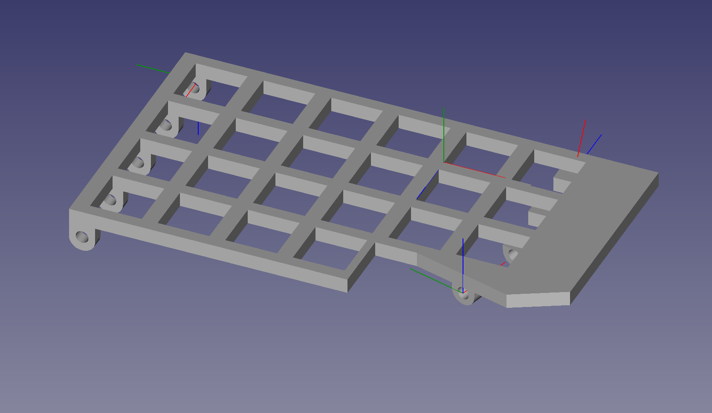
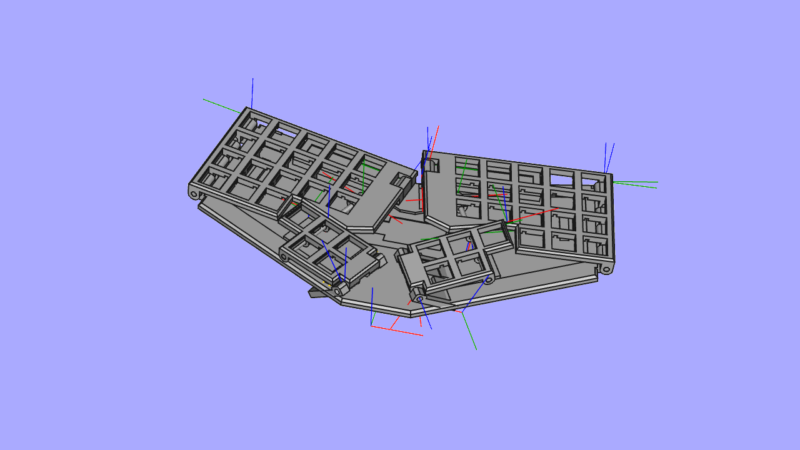
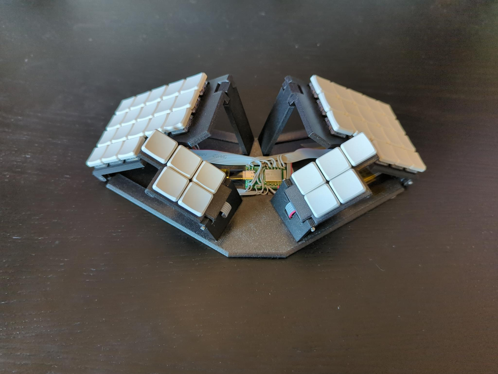
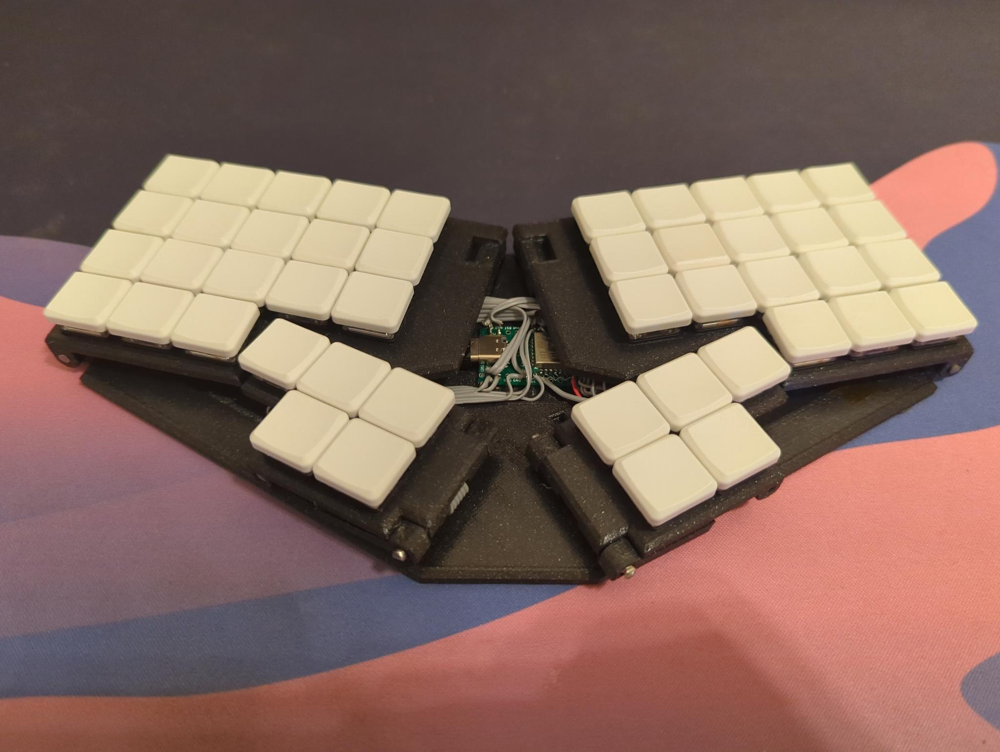
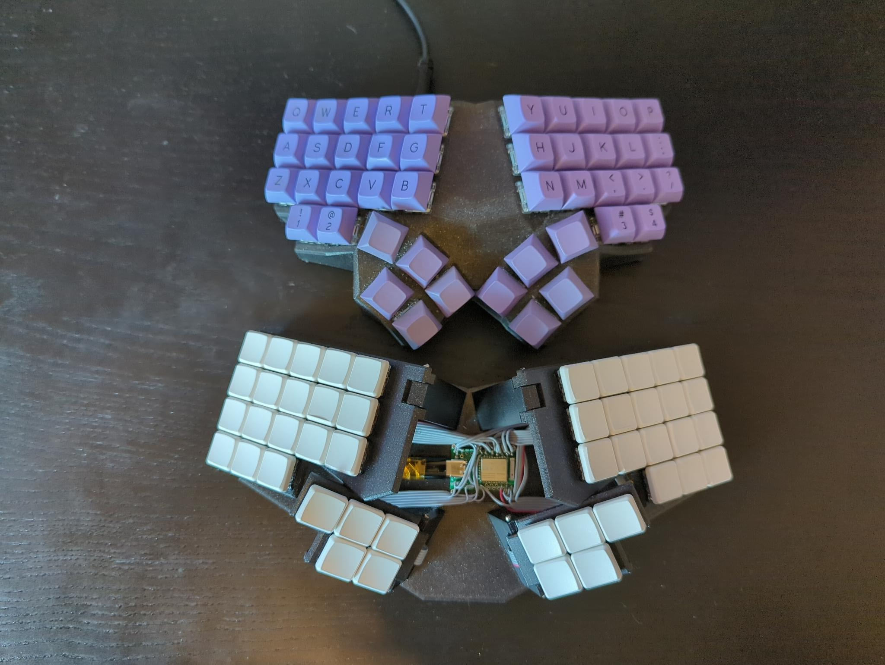

# WIP

4x6 mod of Btrfld

# Btrfld

Pronounced "butter-fold"

A foldable, portable sibling of the btrfly keyboard https://github.com/SolidHal/btrfly-keyboard

More images available in "FinishedPictures" folder









## Features
- 5 key dactyl-manuform-mini thumb cluster
- flat, tented qwerty keys
- 6 extra mappable keys
- bluetooth (optional)
- folds flat for portability

## Parts:

- USB C breakout basic breakout board 
  - Used this one https://www.amazon.com/Type-C-Breakout-Serial-Connector-Converter/dp/B09KC1SMGD/
  - wiring:
  ```
  For most usages, you can just connect VBUS to your 5V input, GND to ground, and D+ and D- as you expect. You can monitor the CC and SBU pins to determine cable polarity, or send side-band data. Or leave them disconnected
  ```

- A USB 2.0 USB C cable to cut up
  - USB C to Micro usb can be gotten pretty cheap

- choc v1 keyswitches

- diodes

- 3mm diameter steel rod
  - 2x 70.5mm
  - 2x 64.7mm
  - 2x 22.7 mm
  - 4x 14.2

- 1.27mm flat ribbon cable

- 1x bluemicro840
  - if you don't want bluetooth, you can just use a promicro instead
  
- 3d printed pieces, located in the STLs folder

## Modifying
Edit `test_fit.FCStd` using FreeCad, I used version `0.19-24366`
I am by no means a FreeCad expert, so I'm sure its built suboptimally. 

## Print Settings:
```
Supports on buildplate
Detect Bridging
100% infill
0.20mm
PLA/PETG
```

## Assembly Tips:

- Must trim a very very slight amount off of the center pin on keyswitches over the body/thumbcluster rod
  - switch above this must be rotated to give clearance for the rod locker

- Body/ThumbCluster Pivot Rob
  - BodyThumbRod Cap gets glued on body end of rod
  - thumb cluster end of rod gets glued in place
  
- Area around the body/baseplate hinge needs clearence, so keep all wires to the other side of the keyswitch

- Reference the images in the "BuildPictures" folder

## Wiring

### Wire lengths:

#### Body -> Baseplate
9 wires
420mm

#### Thumb -> Baseplate
6 wires
240mm
70mm threaded through on the thumb side

- Wiring the underside of the right/left body halves is very tedious
  - Make sure everything stays as flat as possible

- Reference the images in "BuildPictures" and "FinishedPictures" for hints on how to layout the wires

- Reference WiringGuide.png to see see the row/colomn layout


## Flash ZMK Firmware

Prebuilt firmware available in the `Firmware` directory
Bridge ground + reset twice quickly to put the bluemicro840 into flashing mode

*As the handwiring of this keyboard is pretty tricky, this firmware likely won't work properly with another build of the btrfly*


## Build ZMK Firmware

### Github Actions Build

fork this repo, modify the files to your hearts content
the github actions workflow will then build it for you
https://github.com/SolidHal/zmk-config-btrfld

### Local build

Grab my fork of the zmk firmware
```
git clone https://github.com/SolidHal/zmk.git
```

```
cd zmk
source zephyr/zephyr-env.sh
cd app
west build -b bluemicro840_v1 -- -DSHIELD=btrfld
```

make pristine
```
west build -p -b bluemicro840_v1 -- -DSHIELD=btrfld
```


## Future development
- Implement PCB solution, hand wiring this sucks
- Attach trackpoint/ball or touchpad somewhere?
- latch to keep folded?
- latches to retain body/thumb extensions in base?


## References

Animation:
BaseBodyAngle goes from 0 -> 32

firmware:
https://zmk.dev/docs/development/new-shield
https://zmk.dev/docs/development/setup/
https://zmk.dev/docs/troubleshooting
https://github.com/SolidHal/zmk

Friction fit redesign notes:
https://markforged.com/resources/blog/joinery-onyx
https://www.hubs.com/knowledge-base/how-design-snap-fit-joints-3d-printing/
