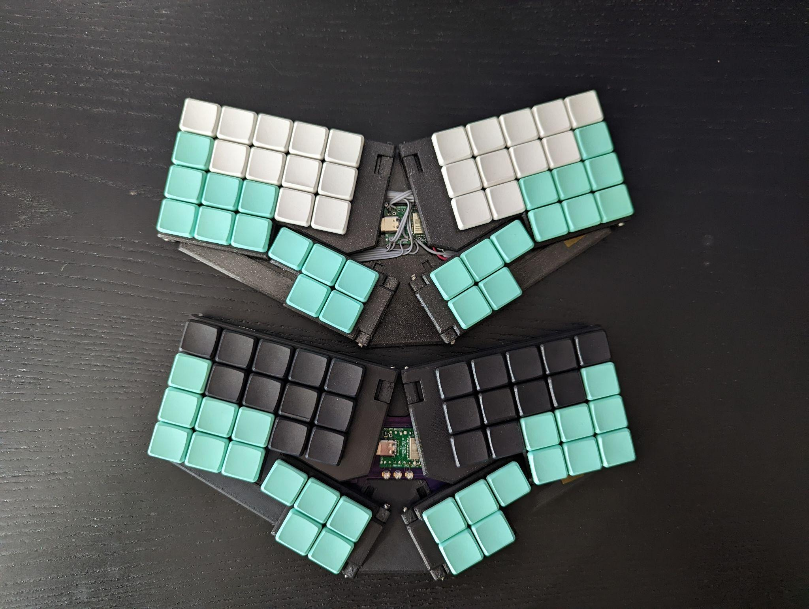

# btrfld and btrfld_ulp

Pronounced "butter-fold"

A foldable, portable sibling of the btrfly keyboard https://github.com/SolidHal/btrfly-keyboard

and a variant, the btrfld ulp (ultra low profile)

More images available in "FinishedPictures" folder

the btrfld folding and unfolding


the btrfld ultra low profile (ulp) from above


the handwired and pcb version of the choc btrfld


the btrfld ultra low profile (ulp) from above, folded


the handwired and pcb version of the choc btrfld, folded up


the btrfld ultra low profile (ulp) next to the btrfld pcb aka choc


the handwired and pcb version of the choc btrfld with its sibling, the btrfly


## Features
- 5 key dactyl-manuform-mini thumb cluster
- flat, tented qwerty keys
- 6 extra mappable keys
- bluetooth (optional)
- folds flat for portability

- btrfld
  - choc switches
  - ~22.5 mm thick
  
- btrfld ulp
  - cherry mx ulp switches
  - ~15.5 mm thick

- 15.5mm thick (btrfld ulp)
- 22.5mm thick (btrfld)

## PCBs


- located in `btrfld_pcb`
- the hand and thumb pcbs are mirrored so they can be used for either hand
- 2 x btrfld_pcb
- 1 x btrfld_pcb_center
- 2 x btrfld_pcb_thumb

## Parts:

- PCBs

- USB C breakout basic breakout board
  - Used this one https://www.amazon.com/Type-C-Breakout-Serial-Connector-Converter/dp/B09KC1SMGD/
  - wiring the usb:
  ```
  For most usages, you can just connect VBUS to your 5V input, GND to ground, and D+ and D- as you expect. You can monitor the CC and SBU pins to determine cable polarity, or send side-band data. Or leave them disconnected
  ```

- A USB 2.0 USB C cable to cut up
  - USB C to Micro usb can be gotten pretty cheap

- 46 choc v1 keyswitches, keycaps OR 46 Cherry MX ULP switches
  - https://github.com/pashutk/Cherry_MX_ULP has information on finding ulp switches
  - if you choose to use ULP switches, you will need to order the solder paste stencils as well as the pcbs and get a hotplate so you can solder them
  - There aren't amazing sources of ULP key caps at this point. The best option i found was to print some. The stls can be found in `ulp_keycap` and `ulp_keycap_homenub` directories. You need a reasonably high resolution SLA printer to get functional keycaps, FDM won't work. 

- 1N4148W SOD-323F diodes
  - Tips for soldering these can be found in the assembly notes section below

- 3mm diameter steel rod
  - 2x 70.5mm
  - 2x 64.7mm
  - 2x 22.7 mm
  - 4x 14.2

- 1.27mm flat ribbon cable
  - 2 x 9 wire cables: 13 cm
  - 2 x 6 wire cables: 9.6 cm

- 1x nicenano OR bluemicro840
  - if you don't want bluetooth, you can just use a promicro instead

- 3d printed pieces, located in the STLs folder
  - 1 copy of everything besides test_fit-UnderbodyWireGuides.stl, which we need 4 of

## Print Settings:
```
Supports on buildplate
Detect Bridging
100% infill
0.20mm
PLA/PETG
```

## Assembly Tips
this process is much less tedious than hand wiring. But its still annoying in places since we are trying to keep things thin.

- btrfld (non-ulp)
    - solder the parallel wires to the hands/thumb clusters *before* placing the boards in the frame and soldering switches
    - trim the stabs on the hinge side keys of the left/right hand bodies (switches for Q,A,Z, P, ;, / keys)

- btrfld ulp
    - use your hotplate to solder the switches first, then the diodes, then the parallel wires. you can then install the pcbs into the 3d printed frames
    - you might need to use something to support balance some switches while solder, since some are only partially supported by the PCB
    - the tolerance between the keycaps and the frames is quite tight. do some testing (and likely sanding) before fully assembling to ensure nothing sticks
    
- stripping ribbon cable:
  - take an xacto knife ~3mm from the end of the cable and cut a slit until you see wire, then use your fingernail to peel the cut off section away from the rest of the cable
- use cut off diode/resistor legs to connect the controller to the center pcb
- the pcbs are designed to hold the diodes "upside down" to keep things as thin as possible. Soldering these is a little hard since they like to stick to the soldering iron.
  - get some fine point electronics tweezers
  - put a very very small amount of solder on one of the diode pads
  - place the diode, the "legs" should keep the diode from completely falling into the hole
  - hold the diode down with the tweezers, and use your iron to reflow the solder. This should hold the diode down enough for you to solder the other diode leg.
  - finally, add some more solder to the first pad
- The UnderbodyWireGuides get super glued into the holes of the pcb. See pictures of the hand underside for details.
- Once you have tested the board, use some superglue to reinforce the ribbon cable solder joints

- Reference the images in the "BuildPictures/PCB" folder


## Flash ZMK Firmware

Prebuilt firmware available in the `Firmware` directory
Bridge ground + reset twice quickly to put the bluemicro840 into flashing mode
Or press the "bootloader" key on the keyboard if you have already flashed the firmware before
then copy the firmware onto the keyboard
```
cp build/zephyr/zmk.uf2 /media/<user>/NRF52BOOT/CURRENT.UF2
```


## Build ZMK Firmware

### Github Actions Build

_This is broken until https://github.com/zmkfirmware/zmk/pull/1499 merges, do a local build instead_
fork this repo, modify the files to your hearts content
the github actions workflow will then build it for you
https://github.com/SolidHal/zmk-config-btrfld

### Local build

Grab my fork of the zmk firmware
```
git clone https://github.com/SolidHal/zmk.git
```

follow https://zmk.dev/docs/development/setup
then
```
cd zmk
cd app
west build -b bluemicro840_v1 -- -DSHIELD=btrfld
```

make pristine
```
west build -p -b bluemicro840_v1 -- -DSHIELD=btrfld
```

## Future development
- Attach trackpoint/ball or touchpad somewhere?
- latch to keep folded?
- latches to retain body/thumb extensions in base?


## Modifying
Edit `test_fit.FCStd` using FreeCad, I used version `0.19-24366`
I am by no means a FreeCad expert, so I'm sure it is built suboptimally.
The pcbs were created in kicad

## Hand Wiring Assembly Tips

### Don't hand wire this thing unless you have lots and lots of time to waste. Use the PCBs instead.

- Wiring the underside of the right/left body halves is very tedious
  - Make sure everything stays as flat as possible

- Reference the images in "BuildPictures" and "FinishedPictures" for hints on how to layout the wires

- Reference WiringGuide.png to see see the row/colomn layout

- Must trim a very very slight amount off of the center pin on keyswitches over the body/thumbcluster rod
  - switch above this must be rotated to give clearance for the rod locker

- Body/ThumbCluster Pivot Rob
  - BodyThumbRod Cap gets glued on body end of rod
  - thumb cluster end of rod gets glued in place

- Area around the body/baseplate hinge needs clearence, so keep all wires to the other side of the keyswitch

- Reference the images in the "BuildPictures" folder

### Hand Wiring Wire lengths:

#### Body -> Baseplate
9 wires
420mm

#### Thumb -> Baseplate
6 wires
240mm
70mm threaded through on the thumb side

## References

Animation:
BaseBodyAngle goes from 0 -> 32

firmware:
https://zmk.dev/docs/development/new-shield
https://zmk.dev/docs/development/setup/
https://zmk.dev/docs/troubleshooting
https://github.com/SolidHal/zmk

Friction fit redesign notes:
https://markforged.com/resources/blog/joinery-onyx
https://www.hubs.com/knowledge-base/how-design-snap-fit-joints-3d-printing/

Cherry MX ULP references:
https://github.com/pashutk/Cherry_MX_ULP

